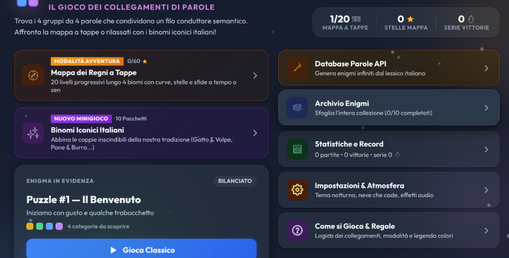

<div align="center">
  
  <p align="center">
    <strong>Il gioco dei collegamenti semantici di parole in lingua italiana, con mappa a tappe, minigiochi e fisica interattiva</strong>
  </p>
  <p align="center">
    <a href="https://lexp-hub.github.io/intrecci/"></a>
    
    
    
    
    
    
    
  </p>
</div>

<br>

# Intrecci — Connessioni di Parole

> **Il gioco quotidiano di collegamenti logici e semantici in italiano.**  
> Unisci le 16 tessere in 4 gruppi da 4 elementi legati da un filo conduttore comune. Include una mappa avventura a tappe progressive stile Farm Heroes, il minigioco dei "Binomi Iconici Italiani", l'oracolo degli indizi a due livelli, un generatore infinito da API e un Easter Egg con fisica 2D in stile Google Gravity. Progettato e sviluppato da Lex.

🌐 **Gioca Online:** [https://lexp-hub.github.io/intrecci/](https://lexp-hub.github.io/intrecci/)

### Modalità di Gioco
- **Classica**: 4 tentativi (cuori), valutazione fino a 3 stelle in base alla precisione e serie di vittorie consecutive.
- **A Tempo (Sprint)**: Timer di 90 secondi. Ogni quartetto individuato correttamente conferisce **+20 secondi di tempo bonus**!
- **Zen (Relax)**: Tentativi infiniti (`∞`), nessuna sconfitta: pensato per rilassarsi ed esplorare i collegamenti semantici in totale serenità.

> [!TIP]
> **Easter Egg Gravità**: Digita sulla tastiera la sequenza Konami `↑ ↑ ↓ ↓ → ← → ← B A` (o `↑ ↑ ↓ ↓ ← → ← → B A`) in qualunque momento per far collassare l'intera interfaccia a terra con fisica gravitazionale 2D interattiva.

---

## Caratteristiche Principali

- **Mappa dei Regni a Tappe**: 20 livelli progressivi distribuiti lungo 4 biomi a tema, con tracciato curvilineo, avatar segnaposto dinamico e valutazione a stelle.
- **Minigioco "Binomi Iconici"**: 10 pacchetti con le coppie inscindibili della tradizione italiana (Pane & Burro, Gatto & Volpe, Acqua & Sapone, Cotto & Mangiato...) per collezionare gettoni indizio.
- **Oracolo degli Indizi a Due Livelli**:
  - *Livello 1 (1 gettone)*: Rivela il tema o la categoria segreta di un gruppo ancora nascosto.
  - *Livello 2 (2 gettoni)*: Bagliore dorato radiante su due tessere che appartengono allo stesso gruppo.
- **Database Parole API Generator**: Generatore infinito di enigmi linguistici dal vivo sfruttando il database lessicale italiano open-source.
- **Google Gravity con Matter.js**: Motore fisico di corpi rigidi integrato: tutte le tessere, i bottoni e i titoli precipitano, rimbalzano e possono essere trascinati e lanciati con il mouse o touch screen.
- **Atmosfera & Suoni Rilassanti**: Particelle animate a scelta (fiocchi di neve, lucciole dorate, foglie d'autunno) e feedback audio sintetico su scala pentatonica marimba.
- **Vettoriali OpenMoji Black Personalizzati**: Tutte le icone usano SVG OpenMoji con spessore dei tratti potenziato (`strokeWidth 4.2px`), senza dipendere da emoji di sistema frammentate.
- **Salvataggio Locale Persistente**: Progressione, stelle, gettoni indizio e impostazioni salvati automaticamente in `localStorage`.

---

## Mappa dei Regni (I 4 Biomi)

| Bioma | Livelli | Tema | Icona |
| :--- | :---: | :--- | :---: |
| **Pianura delle Parole** | `1 - 5` | Natura, stagioni, suoni campestri e mestieri tradizionali | 🌲 Albero |
| **Borgo dei Sapori** | `6 - 10` | Cucina della nonna, primi piatti, cantina, forno e dolci | 🍝 Pasta |
| **Foresta degli Intrecci** | `11 - 15` | Fauna notturna, legno, musica, minerali e fiori selvatici | 🧭 Bussola |
| **Vetta dei Misteri** | `16 - 20` | Filosofia, enigmi complessi, miti, carte e maestri della letteratura | 🏆 Trofeo |

---

## Controlli & Scorciatoie da Tastiera

| Azione | Tasto / Controllo | Descrizione |
| :--- | :--- | :--- |
| **Selezione Tessera** | `Click / Tap` | Seleziona o deseleziona una tessera (massimo 4 contemporanee) |
| **Verifica Gruppo** | `Invio` / `Enter` | Invia il tentativo per le 4 tessere selezionate |
| **Deseleziona Tutto** | `Esc` / `Backspace` | Azzera istantaneamente la selezione corrente |
| **Rimescola Griglia** | `Barra Spaziatrice` | Mescola la posizione delle tessere rimaste |
| **Easter Egg Gravità** | `↑ ↑ ↓ ↓ → ← → ← B A` | Attiva la simulazione fisica Google Gravity |
| **Ripristina Gravità** | `Esc` (in modalità gravità) | Ripristina istantaneamente l'interfaccia al suo posto |

---

## Avvio Rapido

### 🚀 Gioca Subito nel Browser
Non serve installare nulla, il gioco è utilizzabile direttamente online:  
👉 **[https://lexp-hub.github.io/intrecci/](https://lexp-hub.github.io/intrecci/)**

---

### 💻 Esecuzione Locale

#### 1. Clona il repository
```bash
git clone https://github.com/lexp-hub/intrecci.git
cd intrecci
```

#### 2. Installa le dipendenze
```bash
npm install
```

#### 3. Avvia il server di sviluppo
```bash
npm run dev
```

L'applicazione sarà attiva su [http://localhost:3000](http://localhost:3000).

#### 4. Compilazione per la produzione
```bash
npm run build
```

---

## Ringraziamenti & Open Source Credits

Un ringraziamento speciale a tutti i progetti e le librerie open source che hanno reso possibile la realizzazione di **Intrecci**:

- 🖤 **[OpenMoji](https://openmoji.org/)** (di Daniel Utz, Philipp Antoni e tutti i contributor OpenMoji) — per la straordinaria collezione di emoji vettoriali open-source rilasciata con licenza [CC BY-SA 4.0](https://creativecommons.org/licenses/by-sa/4.0/).
- ⚛️ **[React](https://react.dev/)** — per l'architettura a componenti dichiarativa e performante.
- ⚡ **[Vite](https://vitejs.dev/)** — per il tooling di sviluppo ultra-rapido e il bundling di produzione ottimizzato.
- 🌐 **[Matter.js](https://brm.io/matter-js/)** (di Liam Brummitt) — per il motore di simulazione fisica 2D di corpi rigidi nel browser utilizzato per l'Easter Egg Google Gravity.
- 🎉 **[Canvas-Confetti](https://github.com/catdad/canvas-confetti)** (di Kiril Vatev) — per gli effetti particellari di coriandoli nelle schermate di vittoria.
- 🎨 **[Lucide Icons](https://lucide.dev/)** — per le icone funzionali minimali dell'interfaccia utente.
- 💡 **Ispirazione & Riconoscimenti**:
  - A **[giochinidiparole.com](https://www.giochinidiparole.com/)** per la raffinata direzione artistica a tema scuro con sfere ambientali sfocate, palette calde e microinterazioni eleganti.
  - Al gioco originale **Connections** del *New York Times* per l'idea originale del puzzle semantico a quattro categorie.

---

## Licenza
Rilasciato sotto licenza [MIT](LICENSE). Realizzato con passione da **[Lex](https://github.com/lexp-hub)**.
